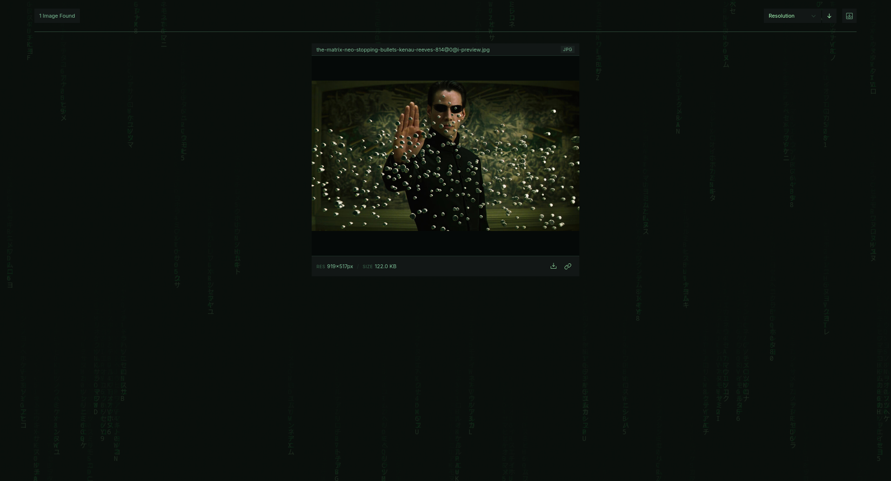

  
  <h1>後ろ · ushiro</h1>

Every image a website doesn't want you to have is still there — just buried. Ushiro drops you behind the scenes to find it. Background images, clickable decoys, alternative resolutions, inline SVGs, base64 chunks, shadow DOM. If it rendered on your screen, you can take it.

## Installation

### From Mozilla Add-ons (recommended)

1. Click "Get the Add-On"
2. Confirm permissions

### Manual install (signed)
1. Download `ushiro-x.x.x.xpi` from the [latest release](https://github.com/gary-host-laptop/mutabu/releases/latest)
2. Open Firefox and go to `about:addons`
3. Click the gear icon ⚙ → **Install Add-on From File**
4. Select the downloaded `.xpi` file
5. Click **Add** when prompted